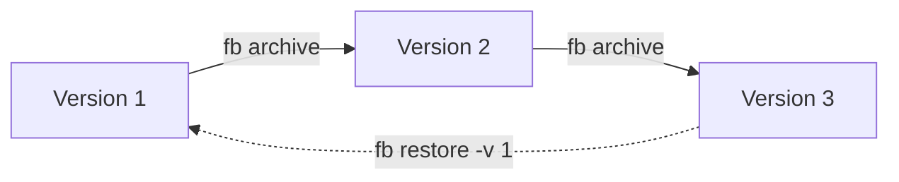

# Frostbyte

> Cold Data Archiving for Data Workflows

Frostbyte is a lightweight tool that compresses, versions, and manages your large data files (CSV, Parquet, Excel). Perfect for data scientists and analysts who need to save disk space while keeping data organized.

## Version Control



## Features

- **Space-Saving Compression**: Reduce storage needs for large datasets
- **Simple Versioning**: Track changes in your data files
- **Easy Commands**: Intuitive CLI with short aliases
- **Local First**: No cloud dependencies, works completely offline

## Quick Installation

```bash
# From source
git clone https://github.com/utkuyucel/Frostbyte.git
cd Frostbyte

# Setup environment
python -m venv frostbyte_venv
source frostbyte_venv/bin/activate

# Install
pip install -e .
```

### Work with Multiple Versions

```bash
# Archive your file
fb archive dataset.csv

# Later, after changes, archive again
fb archive dataset.csv  # Creates version 2

# List all versions
fb ls --all

# Restore a specific version
fb restore dataset.csv -v 1
```

## Command Reference

| Command | Description | Example |
|---------|-------------|---------|
| `fb init` | Setup Frostbyte in your project | `fb init` |
| `fb archive <file>` | Compress and store a file | `fb archive data.csv` |
| `fb ls` | List archived files | `fb ls` or `fb ls --all` |
| `fb stats [file]` | Show compression statistics | `fb stats` or `fb stats data.csv` |
| `fb restore <file>` | Restore a file from archive | `fb restore data.csv` or `fb restore data.csv -v 2` |
| `fb purge <file>` | Remove archive versions | `fb purge old_data.csv` |

## License

[MIT License](LICENSE)
